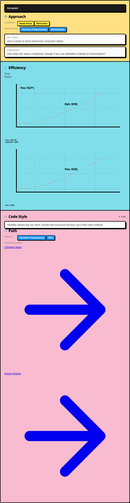
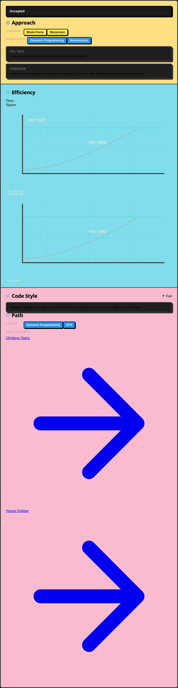
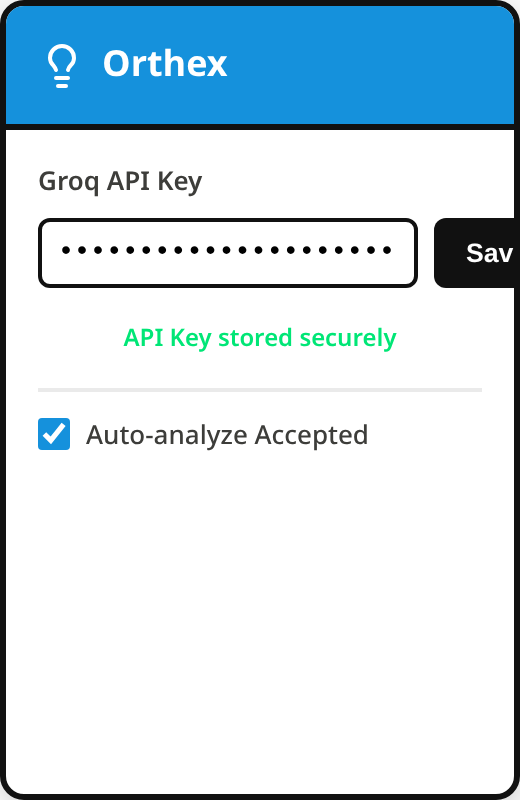
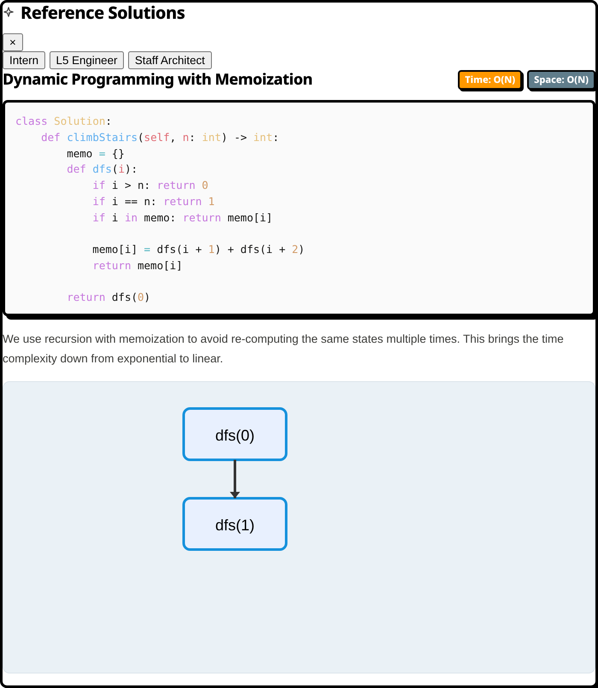

<div align="center">
  
  <br/><br/>

  
  
  
  
  <br/><br/>

  <h1>
    <strong><span style="color:#1591dc"> Orthex</span></strong>
  </h1>
  <p><em>LeetCode AI Code Review &amp; Big-O Checker</em></p>
  <p>
    A multi-pass AI debrief that runs directly inside LeetCode.<br/>
    Analyze your approach. Visualize complexity. Learn what to study next.
  </p>
  <p>
    <strong>No account &nbsp;·&nbsp; No server &nbsp;·&nbsp; No cost</strong>
  </p>
</div>

---

## What it does

Orthex runs **three sequential analysis passes** on your submission, then generates a personalized learning path.

<table>
  <thead>
    <tr>
      <th style="background:#1591dc;color:#fff;padding:8px 14px">Pass</th>
      <th style="background:#1591dc;color:#fff;padding:8px 14px">Feature</th>
      <th style="background:#1591dc;color:#fff;padding:8px 14px">What you get</th>
    </tr>
  </thead>
  <tbody>
    <tr>
      <td align="center"><kbd>01</kbd></td>
      <td>
        
        <strong>Approach Analysis</strong>
      </td>
      <td>Identifies your algorithmic technique (DFS, DP, Two Pointers…), compares it to the optimal, and leaves you with one sharp follow-up question.</td>
    </tr>
    <tr>
      <td align="center"><kbd>02</kbd></td>
      <td>
        
        <strong>Complexity Visualization</strong>
      </td>
      <td>Estimates your current time &amp; space complexity and the theoretical optimum, plotting both on an animated SVG graph — O(1) → O(2ⁿ).</td>
    </tr>
    <tr>
      <td align="center"><kbd>03</kbd></td>
      <td>
        
        <strong>Code Style Review</strong>
      </td>
      <td>Rates readability and structure: <code>Excellent</code> / <code>Good</code> / <code>Fair</code> / <code>Poor</code> — with concise, actionable critique.</td>
    </tr>
    <tr>
      <td align="center"><kbd>04</kbd></td>
      <td>
        
        <strong>Learning Path</strong>
      </td>
      <td>Recommends 2–3 specific LeetCode problems and the concepts behind them based on what the analysis found.</td>
    </tr>
    <tr>
      <td align="center"><kbd>✦</kbd></td>
      <td>
        
        <strong>Solutions</strong>
      </td>
      <td>Generates <em>Intern · L5 Engineer · Staff Architect</em> approaches, streamed with step-by-step Mermaid flowchart explanations.</td>
    </tr>
  </tbody>
</table>

> **Supported verdicts:** 
>  Accepted &nbsp;·&nbsp; Wrong Answer &nbsp;·&nbsp; TLE &nbsp;·&nbsp; MLE &nbsp;·&nbsp; Runtime Error &nbsp;·&nbsp; Compile Error

<br/>
<div align="center">
  
  
  <p><em>The main analysis panel matching your LeetCode theme.</em></p>
</div>

---

## How it works

```
Submit on LeetCode
        ↓
  content.js extracts problem title, difficulty,
  language, verdict, runtime, memory, and code
        ↓
  service-worker.js sends a structured prompt
  to Groq  →  llama-3.3-70b-versatile
        ↓
  JSON response parsed into 4 analysis panels
        ↓
  Result cached in chrome.storage.local
  (repeat views cost zero API tokens)
```

---

## Requirements

-  **Browser**: Google Chrome or any Chromium-based browser
-  **API Key**: A free [Groq API key](https://console.groq.com/keys) — the free tier is more than enough for daily practice

---

## Installation

> Orthex is not yet published to the Chrome Web Store. Load it as an unpacked extension:

1. Download or clone this repository.
2. Open Chrome → `chrome://extensions/`
3. Enable **Developer mode** (toggle, top-right).
4. Click **Load unpacked** → select the project folder.
5. The Orthex icon appears in your toolbar.

**Configure your API key:**

1. Click the Orthex icon.
2. Paste your Groq API key → click **Save**.
3. The status indicator turns `🟢 green` when stored. The key lives in `chrome.storage.sync` and never leaves your browser.

<br/>
<div align="center">
  
  <p><em>Securely store your API key in Chrome's synced storage.</em></p>
</div>

---

## Usage

Navigate to any [LeetCode problem](https://leetcode.com/problems/), write a solution, and submit.

| Mode | How to trigger | Behavior |
|---|---|---|
|  **Auto** *(default)* | Submit a solution | Panel appears automatically for Accepted, WA, and TLE. Configurable in settings. |
|  **Manual** | Click **Analysis** button | Trigger on demand. Click again to dismiss. |
|  **Solutions** | Click **Solutions** button | Streams 2–3 approaches with Mermaid flowcharts. |

<br/>
<div align="center">
  
  <p><em>Explore multiple reference solutions ranging from Intern to Staff Architect approaches.</em></p>
</div>

---

## Privacy

Your code goes **directly from your browser → Groq's API**. Orthex has:

- ✦ No backend server
- ✦ No database
- ✦ No telemetry

Your API key is stored locally in Chrome's sync storage. **We never see your code.**

> The BYOK (Bring Your Own Key) model is not a workaround — it is the architecture. We will not offer a tier that routes your code through our servers.

---

## File Structure

```text
├── manifest.json              — Chrome Extension Manifest V3
├── DESIGN.md                  — Design system reference
├── BRAND.md                   — Brand guidelines and voice
├── background/
│   └── service-worker.js      — Groq API calls, caching, response parsing
├── scripts/
│   ├── content.js             — DOM injection, analysis panels, theme sync
│   └── extractor.js           — Extracts submission data from LeetCode's DOM
├── styles/
│   ├── main.css               — Design tokens: colors, typography, spacing
│   └── panel.css              — Analysis panel component styles
├── popup/
│   ├── popup.html             — Settings popup
│   ├── popup.js               — API key storage, settings logic
│   └── popup.css              — Popup styles
├── assets/
│   └── icon.svg               — Premium Tetris brand icon
└── lib/
    ├── marked.min.js          — Markdown renderer
    └── mermaid.min.js         — Flowchart renderer
```

---

## Model & API

| Property | Value |
|---|---|
|  **Model** | `llama-3.3-70b-versatile` via Groq |
| **Tokens / analysis** | ~800 (prompt + response) |
| **Tokens / solution** | Up to 4,000 per approach |
|  **Rate limit handling** | Exponential backoff in service worker |

---

## Permissions

| Permission | Reason |
|---|---|
|  `storage` | Store your API key and analysis cache |
|  `unlimitedStorage` | Cache results across many submissions |
|  `activeTab` | Read the current LeetCode submission page |
|  `scripting` | Inject the analysis panel into the page |
|  `https://leetcode.com/*` | Run on LeetCode problem and submission pages |
|  `https://api.groq.com/*` | Send requests to Groq's API |

---

## Limitations

- **DOM dependency** — Orthex reads submitted code from the DOM. LeetCode UI updates may break the code extraction selector. If only stats appear without code, the selector likely changed.
- **AI estimates** — Complexity grades and approach suggestions reflect the model's pattern recognition. Treat them as a starting point, not absolute ground truth.
- **Mermaid edge cases** — Syntax errors in complex auto-generated diagrams are caught and suppressed. The step-by-step explanation text still renders.
