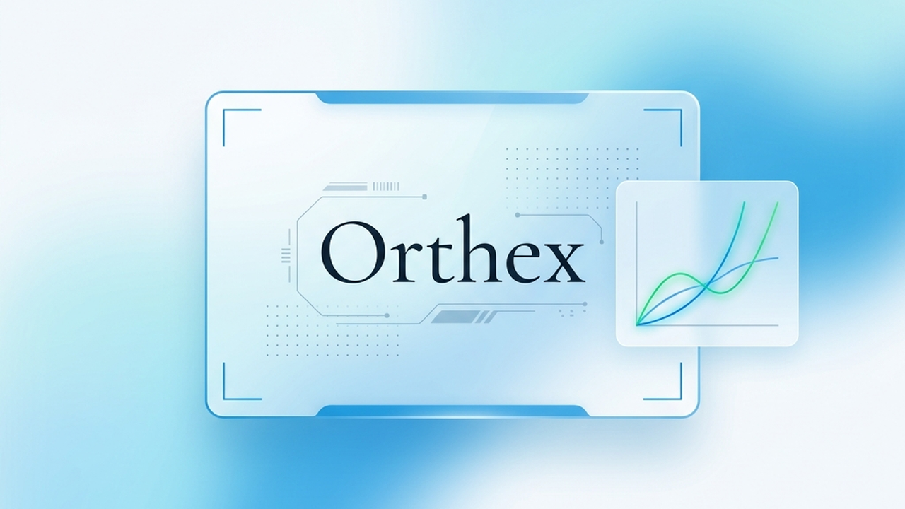

<p align="center">
  
</p>

# ⚡ Orthex: LeetCode AI Code Review & Big-O Checker

Orthex is a free Chrome extension that runs a multi-pass AI debrief directly inside LeetCode's submission results page. After every submission — accepted or not — it analyzes your approach, plots your time and space complexity on an interactive graph, reviews your code style, and recommends what to study next. It uses Groq's fast inference API and runs entirely in your browser.

No account. No server. No cost.

---

## What it does

Orthex runs three sequential analysis passes on your submission, then generates a learning path:

**Approach analysis** — Tags your current algorithmic technique (DFS, DP, Two Pointers, etc.), compares it against the optimal approach, distills the core insight of the problem into one sentence, and leaves you with one follow-up question to push your thinking further.

**Complexity visualization** — Estimates your current time and space complexity and the theoretical optimum, then plots both on an animated SVG graph so you can see exactly where your solution sits on the O(1) → O(2ⁿ) curve. This is not a badge. It is a real interactive chart.

**Code style review** — Rates your code on readability and structure (Excellent / Good / Fair / Poor) and provides one or two sentences of actionable critique, the kind a senior engineer would give in a code review.

**Learning path** — Recommends two or three specific LeetCode problems to try next and the underlying concepts to review, based on what the analysis found.

Orthex handles all LeetCode verdicts: Accepted, Wrong Answer, Time Limit Exceeded, Memory Limit Exceeded, Runtime Error, and Compile Error. The most useful feedback often comes from failed submissions.

---

## How it works

The extension injects a content script on LeetCode's submission pages. When a result loads, it extracts the problem title, difficulty, language, verdict, runtime, memory usage, and your submitted code. It then sends that context to Groq's API (`llama-3.3-70b-versatile`) via a single structured prompt and parses the JSON response into four analysis panels. For solution generation, it runs two sequential passes: one to generate code, one to stream a step-by-step markdown explanation with a Mermaid flowchart.

Results are cached in `chrome.storage.local` so repeat views of the same submission do not consume API quota.

---

## Requirements

- Google Chrome (or Chromium-based browser)
- A free [Groq API key](https://console.groq.com/keys) — the free tier is more than sufficient for daily LeetCode practice

---

## Installation

Orthex is not yet published to the Chrome Web Store. Load it as an unpacked extension:

1. Download or clone this repository to your machine.
2. Open Chrome and navigate to `chrome://extensions/`.
3. Enable **Developer mode** using the toggle in the top right corner.
4. Click **Load unpacked** and select the project folder.
5. The Orthex icon will appear in your Chrome toolbar.

**Configure your API key:**

1. Click the Orthex icon in the toolbar.
2. Paste your Groq API key into the field and click **Save**.
3. The status indicator turns green when the key is stored. The key is saved in `chrome.storage.sync` and never leaves your browser.

---

## Usage

Go to any [LeetCode problem](https://leetcode.com/problems/), write a solution, and submit it. When the submission result page loads:

- **Auto mode (default):** The analysis panel appears automatically for Accepted, Wrong Answer, and TLE verdicts. You can configure which verdicts trigger auto-analysis in the extension settings.
- **Manual mode:** Click the **Analysis** button next to the Solution button to trigger analysis on demand. Click it again to dismiss the panel.

For solution generation, click the **Solutions** button on the problem description panel. Orthex generates two or three distinct approaches (Intern, L5 Engineer, Staff Architect) and streams a step-by-step explanation with a Mermaid flowchart for each.

---

## Privacy

Your code is sent directly from your browser to Groq's API. Orthex has no backend server, no database, and no telemetry. Your API key is stored locally in Chrome's sync storage. We never see your code.

The BYOK (Bring Your Own Key) model is not a workaround — it is the architecture. We will not offer a tier that routes your code through our servers.

---

## File structure

```text
├── manifest.json              — Chrome Extension Manifest V3
├── DESIGN.md                  — Design system reference
├── BRAND.md                   — Brand guidelines and voice
├── background/
│   └── service-worker.js      — Groq API calls, caching, response parsing
├── scripts/
│   ├── content.js             — DOM injection, analysis panels, theme sync
│   └── extractor.js           — Extracts submission data from LeetCode's DOM
├── styles/
│   ├── main.css               — Design tokens: colors, typography, spacing
│   └── panel.css              — Analysis panel component styles
├── popup/
│   ├── popup.html             — Settings popup
│   ├── popup.js               — API key storage, settings logic
│   └── popup.css              — Popup styles
├── assets/
│   ├── icon-16.png
│   ├── icon-48.png
│   └── icon-128.png
└── lib/
    ├── marked.min.js          — Markdown renderer for step-by-step explanations
    └── mermaid.min.js         — Flowchart renderer for algorithm visualizations
```

---

## Model and API

Orthex uses `llama-3.3-70b-versatile` via Groq. Each full analysis uses approximately 800 tokens (prompt + response). Solution generation with step-by-step explanations uses up to 4,000 tokens per solution.

Groq's free tier is sufficient for typical daily practice. The service worker includes exponential backoff retry logic for rate limit errors.

---

## Permissions

| Permission | Reason |
|---|---|
| `storage` | Store your API key and analysis cache |
| `unlimitedStorage` | Cache analysis results across many submissions |
| `activeTab` | Read the current LeetCode submission page |
| `scripting` | Inject the analysis panel into the page |
| `https://leetcode.com/*` | Run on LeetCode problem and submission pages |
| `https://api.groq.com/*` | Send requests to Groq's API |

---

## Limitations

- Orthex reads your submitted code from the DOM. On some LeetCode UI updates, the code extraction selector may break. If the panel shows an analysis based on stats only, it means the code block was not found in the page.
- The AI analysis reflects the model's understanding of algorithmic patterns. Treat the complexity estimates and approach suggestions as a starting point for your own thinking, not as ground truth.
- Solution generation streams a step-by-step Mermaid diagram. Mermaid syntax errors in complex diagrams are caught and suppressed; the explanation text still renders.
